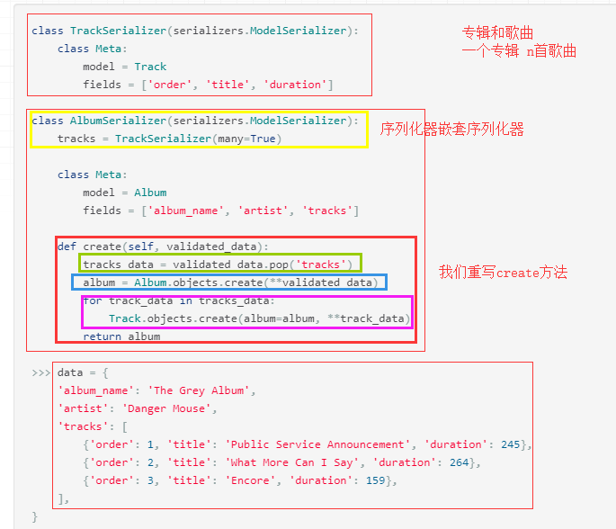
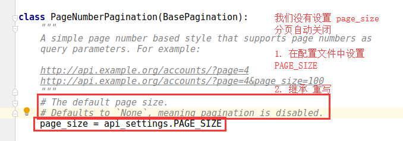

# 序列化与反序列化

前端->发送JSON->

后端->接受JSON->

JSON转换为字典->

字典经过序列化转换成模型对象（调用create的某某模型.objects.create(**validated_data)）->

模型对象经过orm，存入数据库(当前序列化对象进行.save()，根据键值对生成sql语句，数据库进行运行)

使用sql语句查询到值，从数据库取出模型对象，进行相关过滤操作->

模型对象经过反序列化转换成字典->

字典转换成JSON->

后端->发送JSON->

前端->接受JSON->

JSON就是相关数据

# 常用类概略图

# 日常使用技巧

# 第一天

# 第二天

# 第三天

